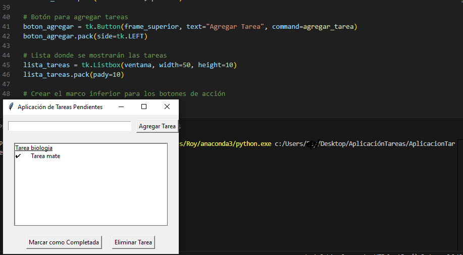

# Aplicación de administración de tareas
 Este código crea una ventana con las funciones de un administrador de tareas o bloc de notas, con el cual se pueden agregar, marcar como completadas o eliminar, dependiendo de las necesidades del usuario que la esté empleando.

## Modo de uso 
 1. Tiene que tener instalado la biblioteca tkinter en su computadora.
 2. La terminal tiene que estar en el mismo directorio donde se encuentra el archivo .py para poder ejecutarlo.
 3. El comando para ejecutar el programa es el siguiente: py (Recorrido donde se encuantra su directorio)./AplicacionTareas/AplicacionTareas.py .

## Ejemplo de ejecución
